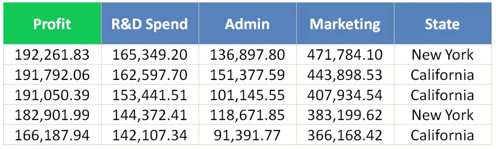
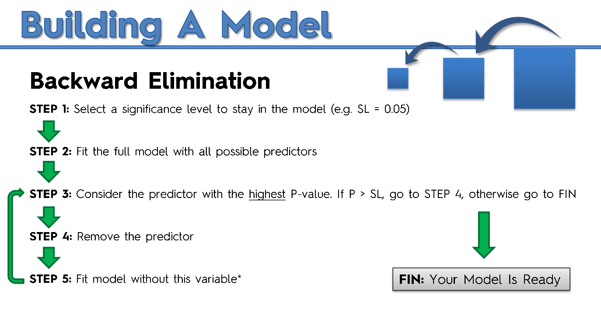

# Multiple-Linear-Regresssion---Investing-on-companies-depending-on-thier-various-parameters

A clompany wishes to invest on start ups .Based on the data of the 50 start ups that they have they decide to fit a mutiple linear regression model.

The datset contains various attributes as shown below in the figure

As shown in the figure, there are four independent attribute and one dependent attribute (Profit). Each attribute may contribute to the performance of the model. One of the attributes is a categorical data, so it has to be one hot encoded before pushing it to the model.

We will employ two methods of Multiple Linear regression 

1) Using simple multiple linear regression where all the data are provided to the system and the model is built upon the data.

2) Using multiple linear regression using Backward elimination procedure.The steps for backward eliniation are shown in the figure below

The model looks into p value everytime for each attribute and if the p value for a particular attribute is greater than significant value (Here in this case is 0.05), it is deleted and the model is trained again.The process is continued unless we attain the data which has attributes having p value less than significant threshold.

A good document on p value selection is given below 
[a link](https://www.wikihow.com/Calculate-P-Value)

The codes are written in the file -- MultipleLInearRegression.py
Additional Helper files which contains two functions: a) BackwardElimination with pvalue b) BackwardElimination with pvalue and Adjusted RSquared -- HelperFunctionsMultipleRegression.py

After the model is tarined we find that the model is fitting the data properly and is a better estimate than the simple multiple linear regression model as we have to deal with relatively less number of data attributes.
